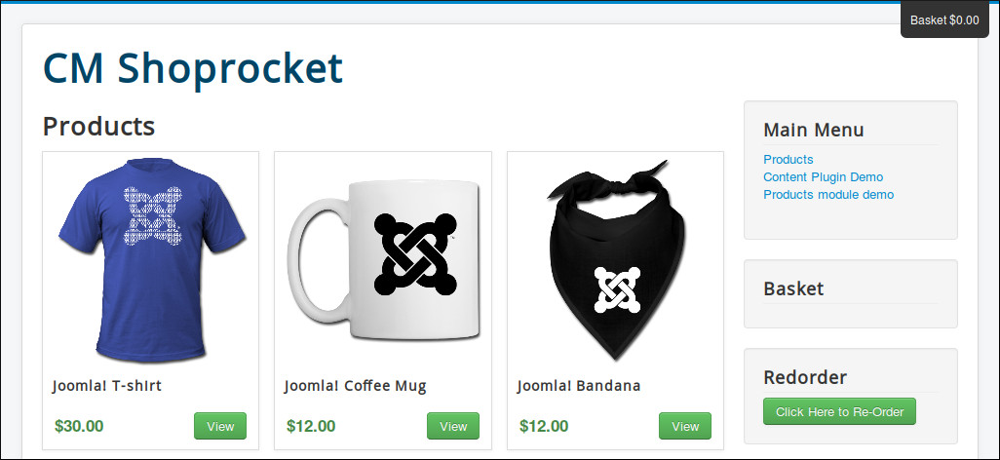

=============
Basket Module
=============

In Modules section in your Joomla! back-end you find the module "CM Shoprocket - Basket module" or click "New" button on the toolbar to create one.

.. image:: ../images/module_list.jpg

There are 2 options for this module:

* **Style**: You can use the default style of Shoprocket which shows the basket on the top right corner of web page. If you use your template style you may need to add your own CSS styles if the basket doesn't look good.
* **Label**: The label of your basket, like "Shopping cart" or "Your cart",...

If you use the default style, you may see an empty space where you put the basket module.

The reason of this is what the module shows is already showed on the top right corner. To solve this you edit the module, switch to "Advanced" tag, switch to the last option "Modle Style" to "none".

Go back to front-end, the empty space now disappears.

