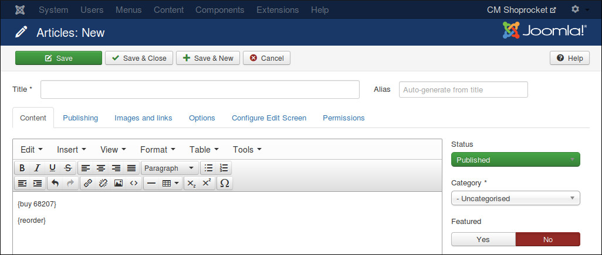
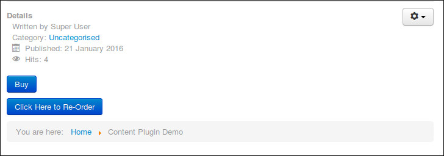

============================
Buy Button & Re-Order Button
============================

You can show the buy button of a specific product in Joomla! article, custom HTML module or any extension which uses Joomla! plugin event.

This is perfect when you mention your product in an article and want to show the buy button for that product right inside the article.

Shoprocket has feature to allow customers to purchase what they purchased again by using re-order button. Similar to buy button, you can show re-order button anywhere.

To show buy button, you insert the tag "{buy XYZ}" where you want the button to show (replace XYZ with the ID of your product). You can get the ID of your product in your product form's URL, you can get this URL when you edit a product, for example if your product form's URL is "https://dashboard.shoprocket.co/products/edit/68359" then your product ID is 68359 and your buy button's tag is "{buy 68359}".

For re-order button, you insert the tag "{reorder}".

You also need to enable CMShoprocket Content plugin and enable showing buy and reorder button in CMShoprocket component's configuration.

Your buttons could be showed similar to this screenshot:

