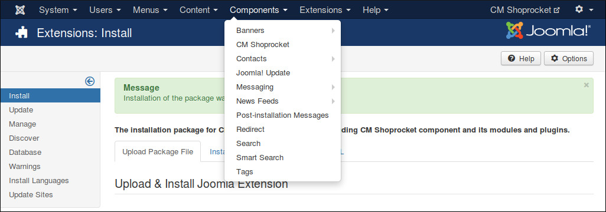
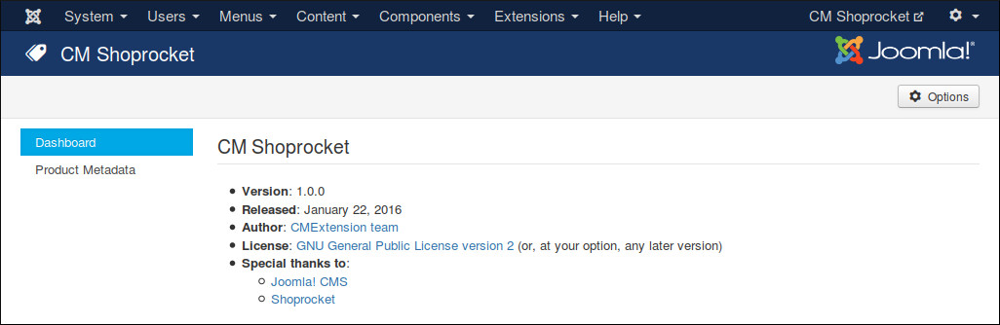
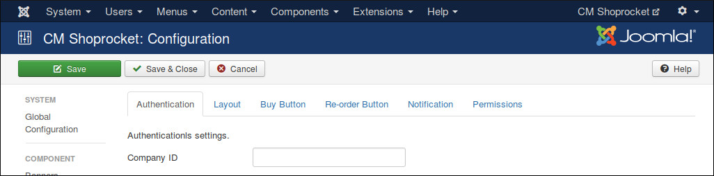
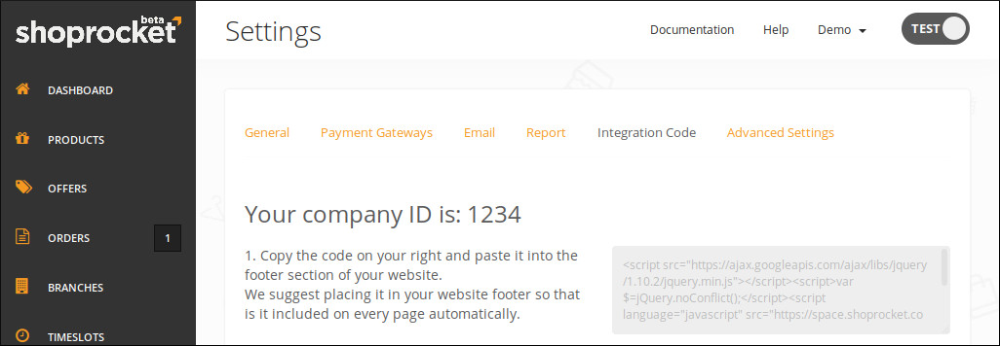
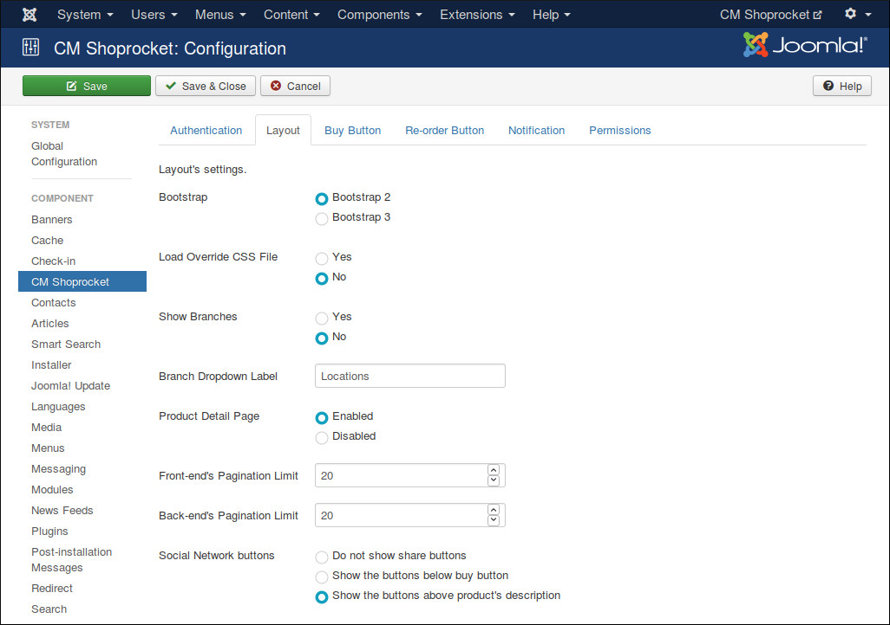
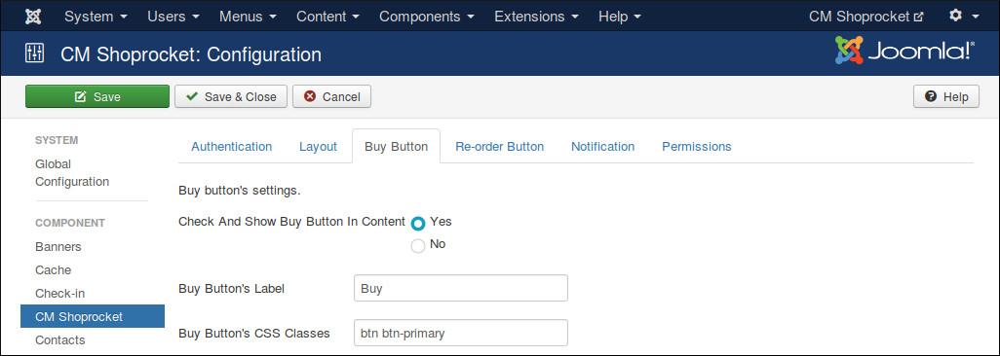
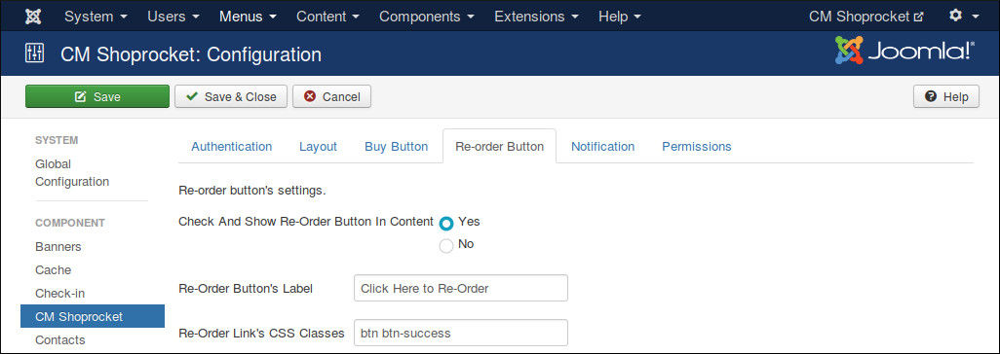
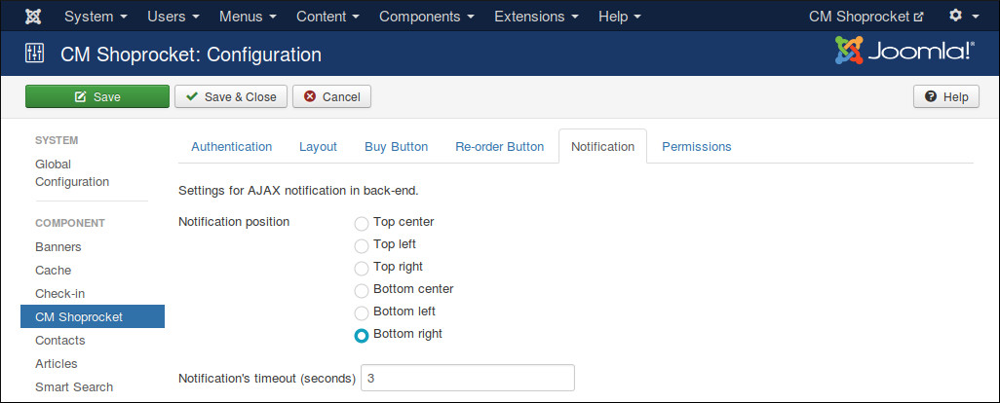
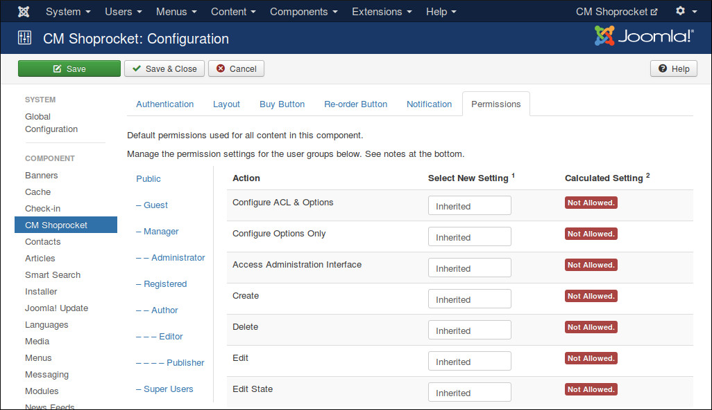

=============
Configuration
=============

In your Joomla!'s back-end, you go to Components -> CM Shoprocket to access CMShoprocket component.

The default page is the dashboard.

You click the "Options" button on the toolbar to configure CMShoprocket. You can find 6 configuration tabs: Authentication, Layout, Buy Button, Re-order Button, Notification and Permissions.

Authentication
==============

In "Authentication" tag you enter your company ID into "Company ID" field.

To get your company ID, you log into Shoprocket, go to Settings -> Integration Code.

Layout
======

In "Layout" tab we have the folling options:

* **Bootstrap:** The Bootstrap version available in front-end. Bootstrap is often loaded by your template.
* **Load Override CSS File:** Load override CSS file to override Shoprocket default styles. You need to create components/com_cmshoprocket/assets/css/shoprocket.css file and add your override CSS styles.
* **Show Branches:** Enable this option if your shop has many branches and you already create these branches in your Shoprocket Dashboard.
* **Branch Dropdown Label:** You can customize the label of branch dropdown list. By default we use "Locations".

Buy Button
==========

In "Buy Button" tab we have the folling options:

* **Check And Show Buy Button In Content:** Enable this option if you want to add buy button to Joomla! article, custom HTML module or to any Joomla! extension which use Joomla! plugin events. You also need to enable CMShoprocket Content plugin.
* **Buy Button's Label:** You can customize the label of buy button by entering your own label into this field.
* **Buy Button's CSS Classes:** This option gives you ability to customize your buy button to fit into your template's styles. For example, if you use a Bootstrap 2 template, you can enter "btn" to create standard Bootstrap button.

Re-order Button
===============

In "Re-order Button" tab we have the folling options:

* **Check And Show Buy Re-Order In Content:** Enable this option if you want to add re-order button to Joomla! article, custom HTML module or to any Joomla! extension which use Joomla! plugin events. You also need to enable CMShoprocket Content plugin.
* **Re-order Button's Label:** Your custom label for re-order button.
* **Re-order Button's CSS Classes:** CSS classes for your button. For example, if you use a Bootstrap 2 template, you can enter "btn" to create standard Bootstrap button.

Notification
============

"Notification" tab contains the options for AJAX notifications in back-end, these notifications notify you if a task is done successfully or if there is any errors.

* **Notification position** Where notification is displayed on the page.
* **Notification's timeout (seconds)** The number of seconds a notification is visible after disappears.

Persmissions
============

"Permissions" tab allows you to configue what users in specific user groups can do.

If you are the only one can access Joomla! back-end or if all the users who can access Joomla! back-end have the same rights, you can leave these options with default settings. However if you allow other users to access Joomla! back-end and want to limit their rights in CMShoprocket component, you can adjust these settings to suit your needs.