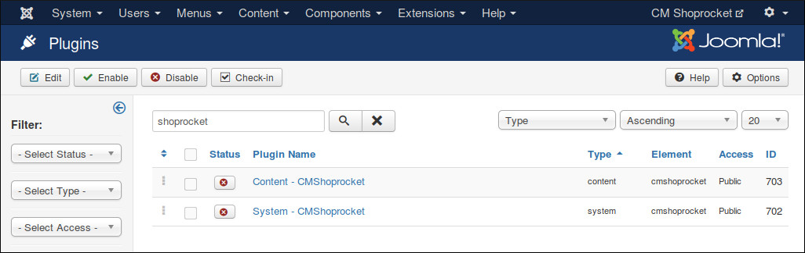

=======
Plugins
=======

In your Joomla! back-end, navigate to Extensions -> Plugins, search for "cmshoprocket", you will find 2 plugins of CMShoprocket.

You need to enable "System - CMShoprocket" plugin in order to connect and load Shoprocket's API on your site.

If you want to show buy button and re-order button in Joomla! article or custom HTML module, you need to enable "Content - CMShoprocket" plugin, you also need to configure in CMShoprocket's configuration.