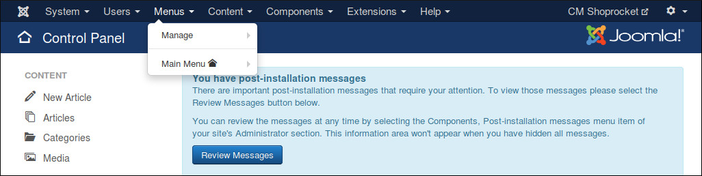
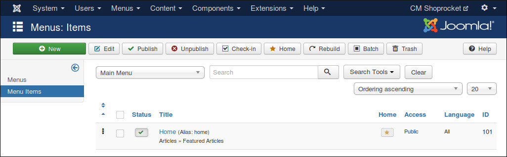
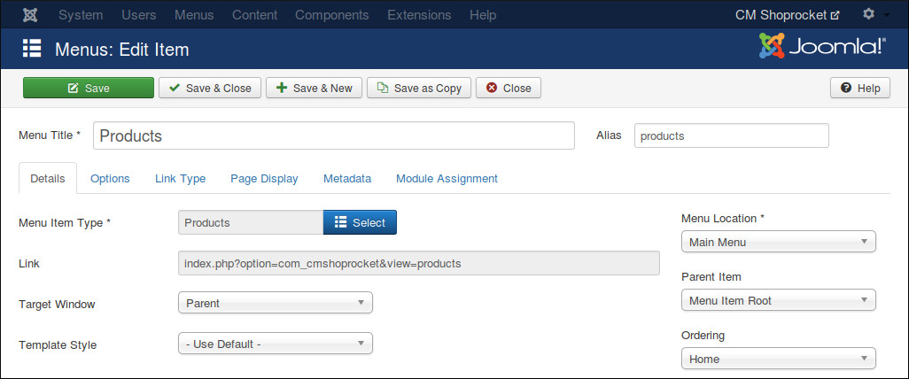
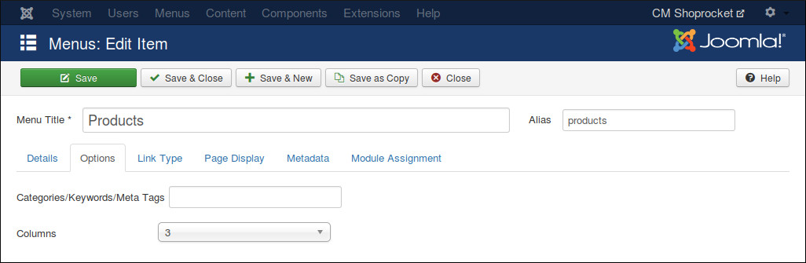
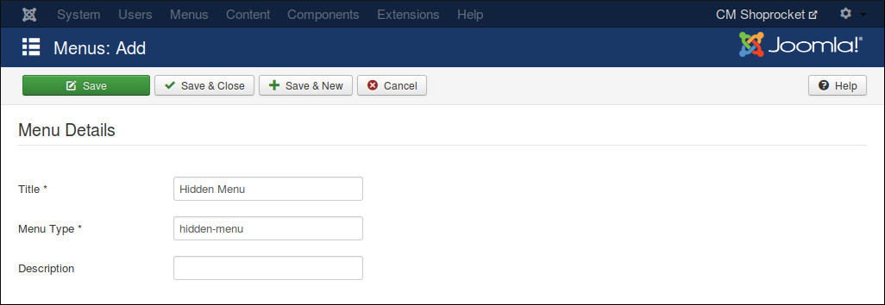
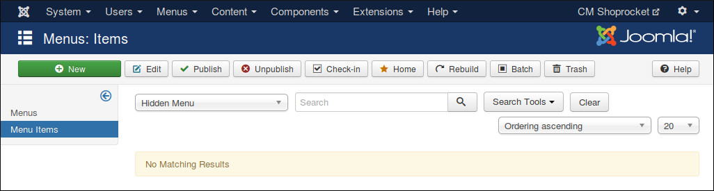
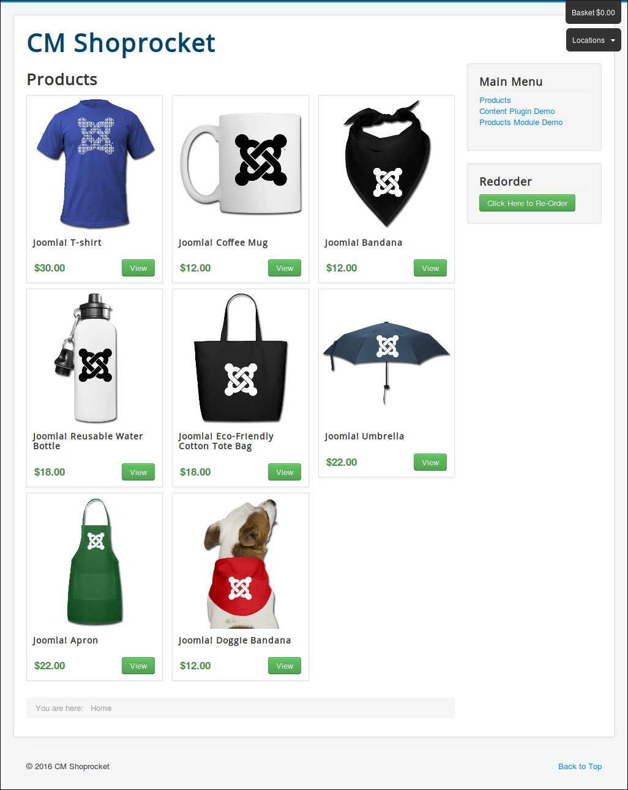
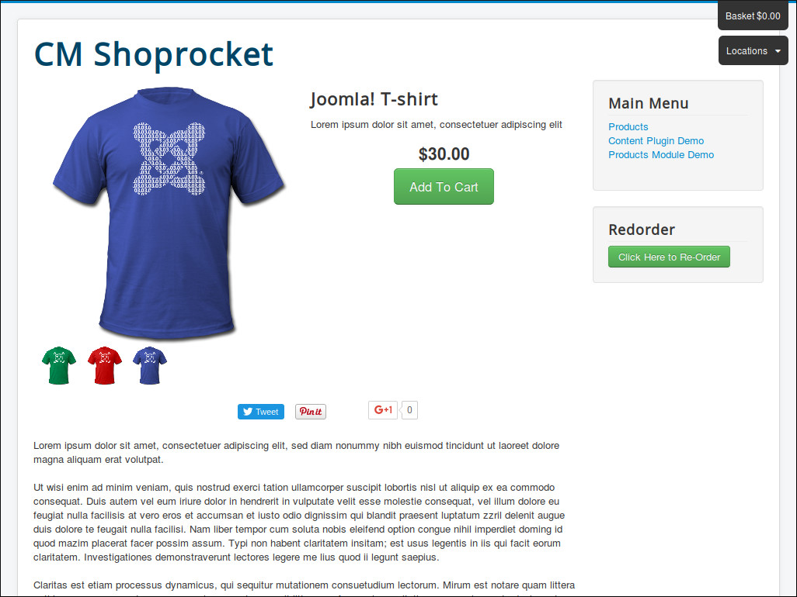
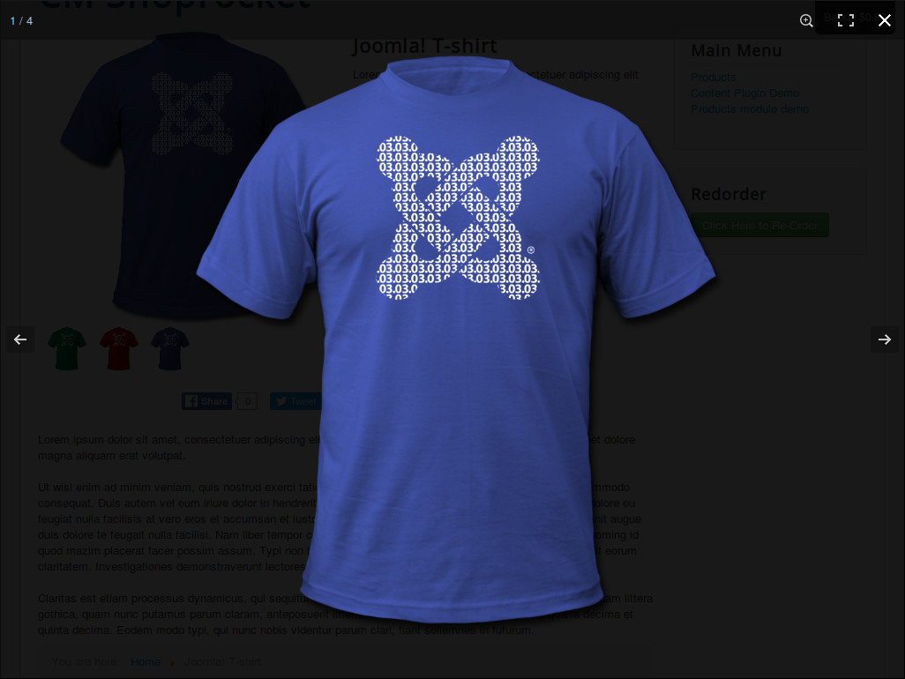

========
Products
========

Products Menu Items
-------------------

To show Shoprocket's products on your site, you need to create a menu item for Products menu item type from CMShoprocket.

In your Joomla! back-end, go to the a menu where you want to put your Products menu item.

Click "New" button to create a new menu item. Select "Products" for "Menu Item Type" field.

Switch to "Options" tab, you select the quantity of the columns in your product list.

If you want to get the products from specific metas, you enter the metas into "Categories/Keywords/Meta Tags" field, seperate them by a comma. For example: tshirt,clothes,jackets.

Product Detail Menu Items
-------------------------

In order to provide SEO for your product detail page and to control the modules in this page, we need to create a hidden menu item for Product menu item type of CMSnipcart.

Product menu item can't be accessed directly, it requires product's slug so we need to hide it from public. To do that we need to put it in a menu which is not assigned to any menu module (hidden menu), then the menu and its menu items are not displayed in front-end.

If you don't have any menu like this yet, you can create one by access Menus -> Manage in your back-end's top menu. Click "New" button on the toolbar to create a new menu. Give your new menu a title and a menu type.

Go to your new menu, click "New" button to create a new menu item. Select "Product (Hidden menu item)" as "Menu Item Type".

Access the product list in front-end, you can see your products are showed.

Click on a product to see its detail.

Click on product image to view it in fullscreen and have ability to zoom it to see it in detail.

