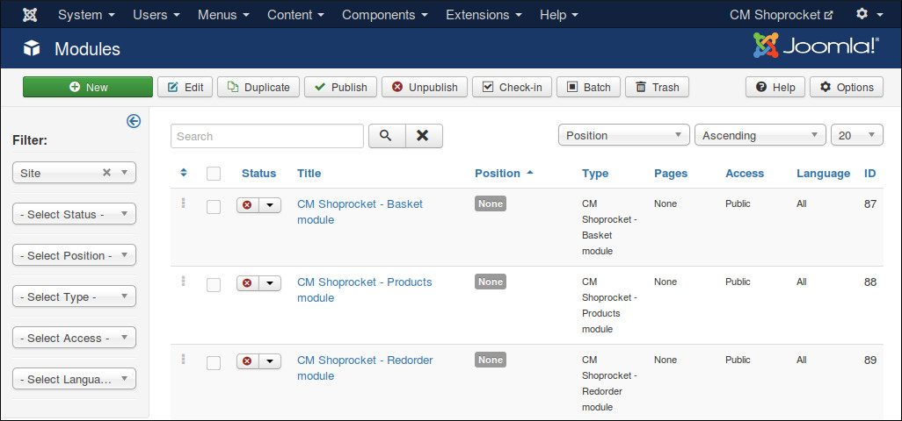
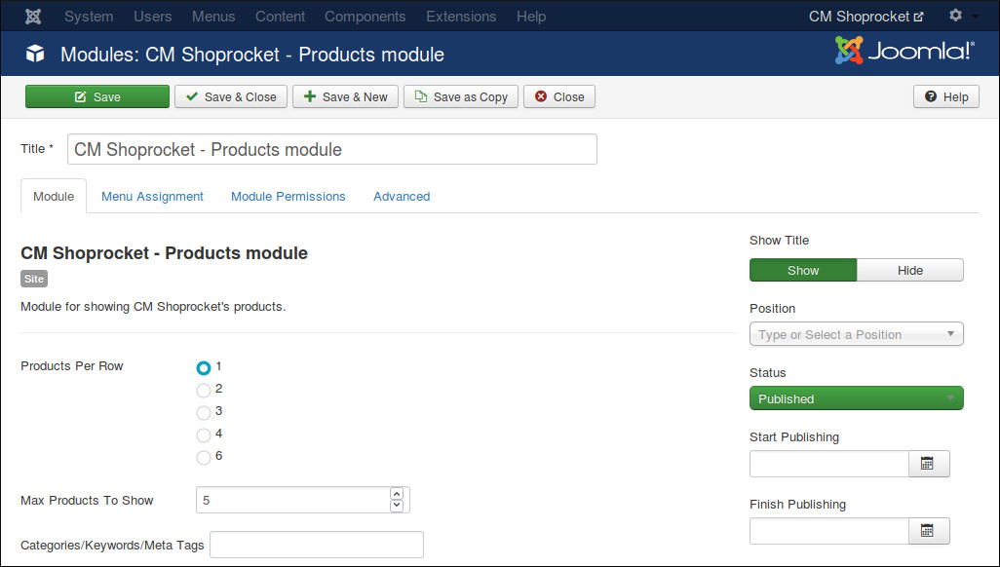
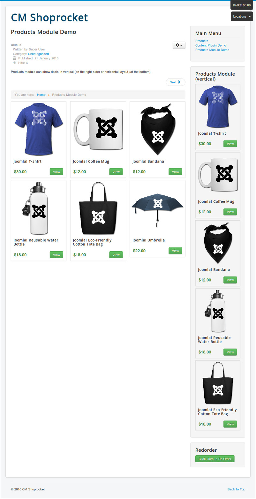

===============
Products Module
===============

In Modules section in your Joomla! back-end you find the module "CM Shoprocket - Products module" or click "New" button on the toolbar to create one.

There are 3 options to configure this module:

* **Product Per Row**: If you select "1" your products are shown in 1 column (vertically).
* **Max Products To Show**: You can limit the quantity of products to show with this option.
* **Categoryies/Keywords/Meta Tags**: If you want to only show the products from specific metas, you enter them into this field and seperate them by comma. For example: phone,iphone,mobile,android.

In the below screenshot, you can see how the products are showed in horizontal and vertical layout.

