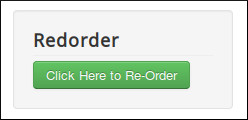

===============
Re-Order Module
===============

In Modules section in your Joomla! back-end you find the module "CM Shoprocket - Reorder module" or click "New" button on the toolbar to create one.

.. image:: ../images/module_list.jpg

Similar to the options in CMShoprocket component's configuration, in this module you can customize the label of re-order button and apply CSS classes to it.

Your re-order module could be displayed similar to this

